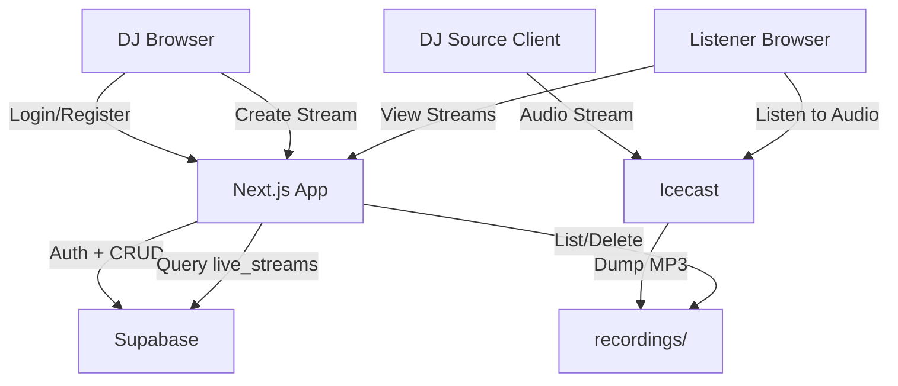

# Architecture

## System Overview

Streamz is a three-tier application for live DJ audio streaming:

```
┌──────────────────────────────────────────────────────────┐
│                        Clients                           │
│                                                          │
│  ┌─────────┐   ┌──────────┐   ┌────────────────────┐    │
│  │ Listener │   │    DJ    │   │  DJ Source Client   │    │
│  │ Browser  │   │ Browser  │   │  (OBS / IceS / etc) │    │
│  └────┬─────┘   └────┬─────┘   └─────────┬──────────┘    │
│       │              │                    │               │
└───────┼──────────────┼────────────────────┼───────────────┘
        │              │                    │
        ▼              ▼                    ▼
┌───────────────────────────┐    ┌──────────────────────┐
│       Next.js 16          │    │      Icecast 2       │
│    (App Router + API)     │    │  (Audio Server)      │
│                           │    │                      │
│  • Server Components      │    │  • Source input       │
│  • Server Actions         │    │  • Listener output    │
│  • API Route Handlers     │    │  • MP3 dump files     │
│  • Middleware (auth guard) │    │  • Mount management   │
│  • Static pages (login,   │    │                      │
│    register)              │    └──────────┬───────────┘
│                           │               │
└─────────┬─────────────────┘               │
          │                                 │
          ▼                                 ▼
┌──────────────────────┐         ┌──────────────────┐
│      Supabase        │         │   recordings/    │
│                      │         │  (filesystem)    │
│  • Auth (email/pw)   │         │                  │
│  • Postgres DB       │         │  MP3 files auto- │
│  • Row Level Security│         │  saved by Icecast│
│  • Genre Categories  │         │                  │
└──────────────────────┘         └──────────────────┘
```

## Request Flow

### Listener viewing the home page

```
Browser → Middleware (session refresh) → app/page.tsx (Server Component)
  → Supabase query: live_streams WHERE is_live = true
  → Rendered HTML returned to browser
```

### DJ logging in

```
Browser → app/login/page.tsx (Client Component)
  → supabase.auth.signInWithPassword()
  → Supabase sets session cookies
  → router.refresh() → Middleware detects auth → redirect to /dashboard
```

### DJ creating a stream

```
Browser → form submit → Dashboard Server Action (createStream)
  → Supabase auth check (getUser)
  → Supabase insert into live_streams
  → revalidatePath('/') and revalidatePath('/dashboard')
  → Fresh data rendered on next request
```

### Listener tuning in to audio

```
Audio player → HTTP GET → Icecast :8000/live/[mount]
  → Icecast streams MP3 audio
  → Simultaneously dumps to recordings/ folder
```

## Component Responsibilities

### Next.js Layer

| File | Role | Rendering |
|------|------|-----------|
| `app/layout.tsx` | Root layout, Geist fonts | Server |
| `app/page.tsx` | Featured, live streams, channels | Server (dynamic) |
| `app/login/page.tsx` | Branded login form | Client (static shell) |
| `app/register/page.tsx` | Registration form | Client (static shell) |
| `app/dashboard/page.tsx` | DJ controls + server actions | Server (dynamic) |
| `app/profile/page.tsx` | Profile view | Server (dynamic) |
| `middleware.ts` | Auth guard + session refresh | Edge |

### UI Components

| Component | Type | Role |
|-----------|------|------|
| `Sidebar` | Server | Fixed left nav with Home/Dashboard/Profile links, active state highlighting |
| `Topbar` | Server | Sticky top bar, auth-aware (shows Login/Sign Up or user email) |
| `RecordingsManager` | Client | Fetch + display + delete recordings via API |
| `HomeClient` | Client | Renders live streams grouped dynamically by genre category |
| `GlobalPlayer` | Client | App-wide audio element state manager using React Context |
| `Visualizer` | Client | WebGL MilkDrop-style visualizer with 8 GLSL shader presets and feedback loops |
| `LiveChat` | Client | Per-stream real-time chat with DJ moderation (delete, mod, ban) |
| `Presence` | Client | User presence heartbeat (updates `last_seen` every 2 minutes) |
| `AvatarUpload` | Client | DJ cover art / avatar image upload to Supabase storage |

### Visualizer Engine (`components/visualizer/`)

The visualizer uses a WebGL pipeline inspired by MilkDrop/Geiss from Winamp:

| File | Role |
|------|------|
| `engine.ts` | WebGL rendering engine with ping-pong framebuffers for feedback-loop effects |
| `shaders.ts` | 8 GLSL fragment shader presets (Warp Tunnel, Plasma Morph, Kaleidoscope, Starfield, Fractal Wave, Liquid Mirror, Geiss Pulse, Acid Worm) |

Audio data is split into bass/mid/treble bands with attack/release smoothing and passed as shader uniforms. Each frame renders into a framebuffer, and the previous frame is fed back as a texture to create the characteristic MilkDrop trail/warp effects.

### Audio Context (`context/AudioContext.tsx`)

The global audio provider manages playback state across all pages with:
- **Auto-recovery**: Uses `useRef` mirrors to avoid stale closures in long-lived error handlers
- **Exponential backoff retry**: 1s → 2s → 4s → ... → 15s max on stream errors
- **Stall detection**: Forces reconnection if buffering exceeds 20 seconds
- **Fresh URL on resume**: Appends timestamp to bypass caches and rejoin at live position

### CSS Design System (`globals.css`)

The design system is inspired by DI.FM and uses custom CSS classes (not Tailwind utilities) for all visual elements:

| Class | Purpose |
|-------|---------|
| `.sidebar`, `.sidebar-link`, `.sidebar-link-active` | Fixed left navigation |
| `.topbar`, `.topbar-btn-primary`, `.topbar-btn-outline` | Sticky top bar |
| `.hero-card`, `.hero-card-overlay` | Wide featured cards with artwork |
| `.stream-card`, `.stream-card-overlay`, `.stream-card-live` | Square channel tiles with live badges |
| `.card-row` | Horizontal-scrolling card container |
| `.section-title` | Section headers with blue underline |
| `.auth-page`, `.auth-card` | Centered auth forms |
| `.form-input`, `.form-btn-blue`, `.form-btn-green` | Styled form elements |
| `.dash-section`, `.config-panel` | Dashboard section cards |
| `.stream-row`, `.recording-row` | List item rows |
| `.live-dot-sm` | Pulsing live indicator animation |

**Color palette:**

| Token | Hex | Usage |
|-------|-----|-------|
| `--background` | `#0d1527` | Page background |
| `--surface` | `#162040` | Card/panel backgrounds |
| `--surface-hover` | `#1c2a52` | Hover state |
| `--accent` | `#3b7bf5` | Primary blue (buttons, links, active states) |
| `--accent-hover` | `#5a93ff` | Blue hover state |
| `--muted` | `#7a8bb5` | Secondary text |
| `--border-color` | `#1e2d54` | Borders |

### Supabase Layer

| Concern | Implementation |
|---------|---------------|
| Authentication | `@supabase/ssr` with `getAll`/`setAll` cookie pattern |
| Server client | `lib/supabase/server.ts` — async, `await cookies()` |
| Browser client | `lib/supabase/client.ts` — `createBrowserClient()` |
| Middleware client | Inline `createServerClient()` with request cookies |
| Database types | `types/supabase.ts` — manually maintained |

### Icecast Layer

| Concern | Implementation |
|---------|---------------|
| Configuration | `icecast.xml` — limits, auth, mount config |
| Source input | Any Icecast-compatible source (OBS, IceS, BUTT) |
| Auto-recording | `dump-file` directive → `recordings/` directory |
| Mount pattern | `/live/*` wildcard mount |
| Source timeout | `30s` — tolerates brief encoder hiccups for 24/7 streaming |

### Sync Service (`scripts/sync-listeners.js`)

A resilient Node.js daemon that polls Icecast every 10 seconds and syncs stream/listener state to Supabase:

| Feature | Implementation |
|---------|---------------|
| Crash protection | Global `uncaughtException` / `unhandledRejection` handlers prevent silent death |
| Request timeout | 8s `AbortSignal.timeout` on Icecast fetch prevents hung requests |
| Adaptive backoff | Consecutive failures increase delay up to 60s max |
| Heartbeat logging | Logs uptime and sync count every ~5 minutes for monitoring |
| Recording management | Spawns/kills `curl` processes to record active streams |

## Data Flow Diagram



## Security Model

1. **Authentication**: Supabase handles email/password auth with JWT sessions stored in HTTP-only cookies
2. **Middleware guard**: Unauthenticated requests to `/dashboard/*` are redirected to `/login`
3. **Server actions**: Each action re-validates the user via `supabase.auth.getUser()` — never trusts client state
4. **API routes**: Check authentication before any file operations
5. **File sanitization**: Recording filenames are sanitized with `path.basename()` and `.mp3` extension enforcement to prevent path traversal
6. **Icecast passwords**: Configurable via environment variables, never hardcoded in production
