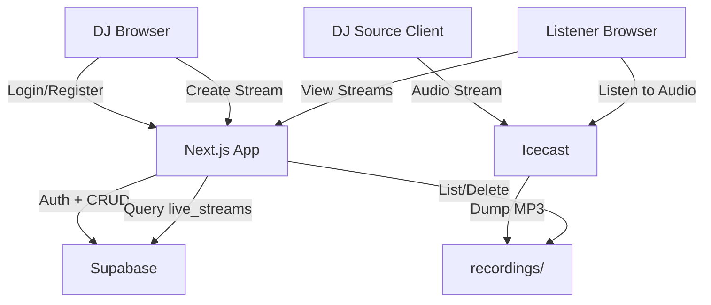

# Architecture

## System Overview

Streamz is a three-tier application for live DJ audio streaming:

```
┌──────────────────────────────────────────────────────────┐
│                        Clients                           │
│                                                          │
│  ┌─────────┐   ┌──────────┐   ┌────────────────────┐    │
│  │ Listener │   │    DJ    │   │  DJ Source Client   │    │
│  │ Browser  │   │ Browser  │   │  (OBS / IceS / etc) │    │
│  └────┬─────┘   └────┬─────┘   └─────────┬──────────┘    │
│       │              │                    │               │
└───────┼──────────────┼────────────────────┼───────────────┘
        │              │                    │
        ▼              ▼                    ▼
┌───────────────────────────┐    ┌──────────────────────┐
│       Next.js 16          │    │      Icecast 2       │
│    (App Router + API)     │    │  (Audio Server)      │
│                           │    │                      │
│  • Server Components      │    │  • Source input       │
│  • Server Actions         │    │  • Listener output    │
│  • API Route Handlers     │    │  • MP3 dump files     │
│  • Middleware (auth guard) │    │  • Mount management   │
│  • Static pages (login,   │    │                      │
│    register)              │    └──────────┬───────────┘
│                           │               │
└─────────┬─────────────────┘               │
          │                                 │
          ▼                                 ▼
┌──────────────────────┐         ┌──────────────────┐
│      Supabase        │         │   recordings/    │
│                      │         │  (filesystem)    │
│  • Auth (email/pw)   │         │                  │
│  • Postgres DB       │         │  MP3 files auto- │
│  • Row Level Security│         │  saved by Icecast│
│                      │         │                  │
└──────────────────────┘         └──────────────────┘
```

## Request Flow

### Listener viewing the home page

```
Browser → Middleware (session refresh) → app/page.tsx (Server Component)
  → Supabase query: live_streams WHERE is_live = true
  → Rendered HTML returned to browser
```

### DJ logging in

```
Browser → app/login/page.tsx (Client Component)
  → supabase.auth.signInWithPassword()
  → Supabase sets session cookies
  → router.refresh() → Middleware detects auth → redirect to /dashboard
```

### DJ creating a stream

```
Browser → form submit → Dashboard Server Action (createStream)
  → Supabase auth check (getUser)
  → Supabase insert into live_streams
  → revalidatePath('/') and revalidatePath('/dashboard')
  → Fresh data rendered on next request
```

### Listener tuning in to audio

```
Audio player → HTTP GET → Icecast :8000/live/[mount]
  → Icecast streams MP3 audio
  → Simultaneously dumps to recordings/ folder
```

## Component Responsibilities

### Next.js Layer

| File | Role | Rendering |
|------|------|-----------|
| `app/layout.tsx` | Root layout, fonts, dark mode | Server |
| `app/page.tsx` | Live streams listing | Server (dynamic) |
| `app/login/page.tsx` | Login form | Client (static shell) |
| `app/register/page.tsx` | Registration form | Client (static shell) |
| `app/dashboard/page.tsx` | DJ controls + server actions | Server (dynamic) |
| `app/profile/page.tsx` | Profile view | Server (dynamic) |
| `middleware.ts` | Auth guard + session refresh | Edge |

### Supabase Layer

| Concern | Implementation |
|---------|---------------|
| Authentication | `@supabase/ssr` with `getAll`/`setAll` cookie pattern |
| Server client | `lib/supabase/server.ts` — async, `await cookies()` |
| Browser client | `lib/supabase/client.ts` — `createBrowserClient()` |
| Middleware client | Inline `createServerClient()` with request cookies |
| Database types | `types/supabase.ts` — manually maintained |

### Icecast Layer

| Concern | Implementation |
|---------|---------------|
| Configuration | `icecast.xml` — limits, auth, mount config |
| Source input | Any Icecast-compatible source (OBS, IceS, BUTT) |
| Auto-recording | `dump-file` directive → `recordings/` directory |
| Mount pattern | `/live/*` wildcard mount |

## Data Flow Diagram



## Security Model

1. **Authentication**: Supabase handles email/password auth with JWT sessions stored in HTTP-only cookies
2. **Middleware guard**: Unauthenticated requests to `/dashboard/*` are redirected to `/login`
3. **Server actions**: Each action re-validates the user via `supabase.auth.getUser()` — never trusts client state
4. **API routes**: Check authentication before any file operations
5. **File sanitization**: Recording filenames are sanitized with `path.basename()` and `.mp3` extension enforcement to prevent path traversal
6. **Icecast passwords**: Configurable via environment variables, never hardcoded in production
