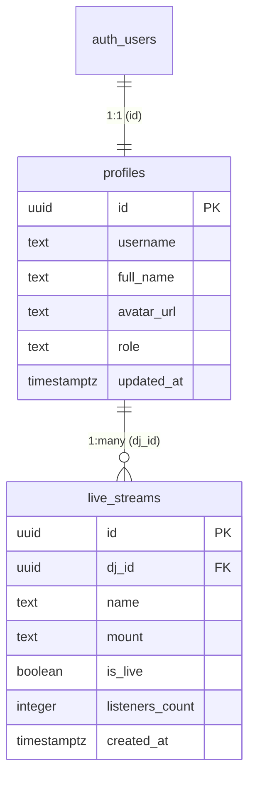

# Database Schema

Streamz uses **Supabase** (hosted Postgres) with two core tables. TypeScript types are maintained in [`types/supabase.ts`](../types/supabase.ts).

---

## Tables

### `profiles`

Stores user profile data, linked 1:1 with Supabase Auth's `auth.users` table.

| Column | Type | Nullable | Default | Description |
|--------|------|----------|---------|-------------|
| `id` | `uuid` | No | — | Primary key, references `auth.users.id` |
| `username` | `text` | Yes | `null` | Display name / DJ name |
| `full_name` | `text` | Yes | `null` | Full name |
| `avatar_url` | `text` | Yes | `null` | Profile picture URL |
| `role` | `text` | Yes | `null` | Either `'dj'` or `'listener'` |
| `updated_at` | `timestamptz` | Yes | `null` | Last profile update |

**SQL:**

```sql
CREATE TABLE public.profiles (
  id UUID PRIMARY KEY REFERENCES auth.users(id) ON DELETE CASCADE,
  username TEXT,
  full_name TEXT,
  avatar_url TEXT,
  role TEXT CHECK (role IN ('dj', 'listener')),
  updated_at TIMESTAMPTZ
);
```

---

### `live_streams`

Represents a stream mount point created by a DJ.

| Column | Type | Nullable | Default | Description |
|--------|------|----------|---------|-------------|
| `id` | `uuid` | No | `gen_random_uuid()` | Primary key |
| `dj_id` | `uuid` | No | — | Foreign key → `profiles.id` |
| `name` | `text` | No | — | Human-readable stream name |
| `mount` | `text` | No | — | Icecast mount path (e.g. `/live/dj-chill-vibes-123456`) |
| `is_live` | `boolean` | No | `false` | Whether the stream is currently active |
| `listeners_count` | `integer` | No | `0` | Current listener count |
| `created_at` | `timestamptz` | No | `now()` | Creation timestamp |

**SQL:**

```sql
CREATE TABLE public.live_streams (
  id UUID PRIMARY KEY DEFAULT gen_random_uuid(),
  dj_id UUID NOT NULL REFERENCES public.profiles(id) ON DELETE CASCADE,
  name TEXT NOT NULL,
  mount TEXT NOT NULL,
  is_live BOOLEAN NOT NULL DEFAULT false,
  listeners_count INTEGER NOT NULL DEFAULT 0,
  created_at TIMESTAMPTZ NOT NULL DEFAULT now()
);
```

---

## Relationships



---

## Row Level Security (RLS)

> **Important:** These policies must be enabled in Supabase for the application to function correctly.

### Profiles

```sql
-- Enable RLS
ALTER TABLE public.profiles ENABLE ROW LEVEL SECURITY;

-- Users can read any profile (for stream listings)
CREATE POLICY "Public profiles are viewable by everyone"
  ON public.profiles FOR SELECT
  USING (true);

-- Users can only update their own profile
CREATE POLICY "Users can update own profile"
  ON public.profiles FOR UPDATE
  USING (auth.uid() = id);

-- Auto-create profile on signup (via trigger)
CREATE POLICY "Users can insert own profile"
  ON public.profiles FOR INSERT
  WITH CHECK (auth.uid() = id);
```

### Live Streams

```sql
-- Enable RLS
ALTER TABLE public.live_streams ENABLE ROW LEVEL SECURITY;

-- Anyone can view live streams (for the home page)
CREATE POLICY "Live streams are viewable by everyone"
  ON public.live_streams FOR SELECT
  USING (true);

-- DJs can only insert their own streams
CREATE POLICY "DJs can create own streams"
  ON public.live_streams FOR INSERT
  WITH CHECK (auth.uid() = dj_id);

-- DJs can only update their own streams
CREATE POLICY "DJs can update own streams"
  ON public.live_streams FOR UPDATE
  USING (auth.uid() = dj_id);

-- DJs can only delete their own streams
CREATE POLICY "DJs can delete own streams"
  ON public.live_streams FOR DELETE
  USING (auth.uid() = dj_id);
```

---

## Auto-Create Profile Trigger

When a user signs up through Supabase Auth, a profile row should be created automatically:

```sql
CREATE OR REPLACE FUNCTION public.handle_new_user()
RETURNS TRIGGER AS $$
BEGIN
  INSERT INTO public.profiles (id, username, full_name, avatar_url)
  VALUES (
    NEW.id,
    NEW.raw_user_meta_data->>'username',
    NEW.raw_user_meta_data->>'full_name',
    NEW.raw_user_meta_data->>'avatar_url'
  );
  RETURN NEW;
END;
$$ LANGUAGE plpgsql SECURITY DEFINER;

CREATE TRIGGER on_auth_user_created
  AFTER INSERT ON auth.users
  FOR EACH ROW
  EXECUTE FUNCTION public.handle_new_user();
```

---

## TypeScript Types

The database types in `types/supabase.ts` mirror the schema above. These are manually maintained — if you change the schema, update the types to match.

Key types used throughout the application:

```typescript
import type { Database } from '@/types/supabase'

// Row types (what you get from SELECT)
type Profile = Database['public']['Tables']['profiles']['Row']
type LiveStream = Database['public']['Tables']['live_streams']['Row']

// Insert types (what you pass to INSERT)
type NewStream = Database['public']['Tables']['live_streams']['Insert']
```
